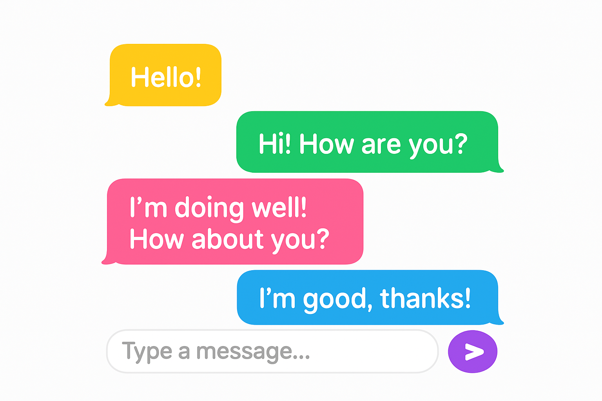

<div align="center">

# **YouTube Search Assignment**
**By: ranafaraji**



*This repository contains the source code for a Java-based YouTube search assignment developed with Gradle. It demonstrates how to implement YouTube search functionality by integrating a search API and rendering the results via an HTML user interface.*  
</div>

---

## Overview

This project was originally created as a coding assignment to explore and implement a simple YouTube search capability. The main objectives of this assignment include:

- **API Integration:** Connecting to YouTube (or a simulated version) to retrieve video search results.
- **Java-Based Implementation:** Using Java as the primary programming language for backend logic.
- **Gradle Build System:** Employing Gradle (with accompanying wrapper scripts) to build, test, and run the project.
- **HTML Front-End:** A lightweight HTML component for displaying search results, if applicable.

With the majority of the code written in Java (approximately 84%) and a complementary HTML component (16%), the project serves as both a learning tool and a template for further exploration into multimedia search applications.

---

## Prerequisites

- **Java Development Kit (JDK):** Ensure you have JDK 8 or later installed.
- **Gradle:** You may install Gradle globally or simply use the provided Gradle wrapper.
- **YouTube Data API Key (Optional):** If you plan on integrating with the live YouTube Data API, obtain an API key from [Google Developers](https://developers.google.com/youtube/v3).

---

## Installation & Setup

1. **Clone the Repository:**

    ```bash
    git clone https://github.com/ranafaraji/Youtub_search_assignment.git
    ```

2. **Navigate to the Project Directory:**

    ```bash
    cd Youtub_search_assignment
    ```

3. **Build the Project Using Gradle:**

    - On Unix-based systems:
      ```bash
      ./gradlew build
      ```
    - On Windows:
      ```bash
      gradlew.bat build
      ```

---

## Running the Application

If the repository contains an executable main class for running the YouTube search, you can execute it via Gradle:

- On Unix-based systems:
  ```bash
  ./gradlew run
  ```
    
- On Windows:
  ```bash
  gradlew.bat run
  ```

This will launch the application (or open a command-line interface) where you can enter search queries and view the retrieved results.

## Project Structure

- **src/main/java**  
  Contains all Java source files that implement the YouTube search logic and API integration.

- **src/main/resources**  
  (If applicable) Holds HTML templates, configuration files, or additional assets required by the application.

- **build.gradle & settings.gradle**  
  The Gradle build files that manage project dependencies, configuration, and build tasks.

- **Gradle Wrapper Scripts:**  
  gradlew and gradlew.bat ensure that the project can be built regardless of the local Gradle installation.

## How It Works

- **Search Query Processing:**  
  The application accepts a user input query, processes it, and then interfaces with the YouTube API (or a simulated endpoint) to retrieve a list of video results.

- **Result Display:**  
  Retrieved data (such as video titles, thumbnails, and IDs) are processed and served through an HTML-based user interface or via the console, depending on the project implementation.

- **Extensibility:**  
  This assignment serves as a starting point. Developers can extend the project by adding features such as pagination, error handling, caching, or incorporating more sophisticated search filtering.

## Contributing

Contributions, improvements, and feedback are highly welcomed. If you have ideas or enhancements:

1. Fork this repository.
2. Create a new branch for your feature or fix.
3. Submit a pull request detailing your changes.

## License

This project is licensed under the MIT License - see the LICENSE file for details.

---

## Final Thoughts

This assignment provides a practical example of how to integrate external APIs, build backend services in Java, and use modern build tools like Gradle. It's an excellent starting point for developers interested in multimedia search applications and further enhancements to YouTube-based search interfaces.